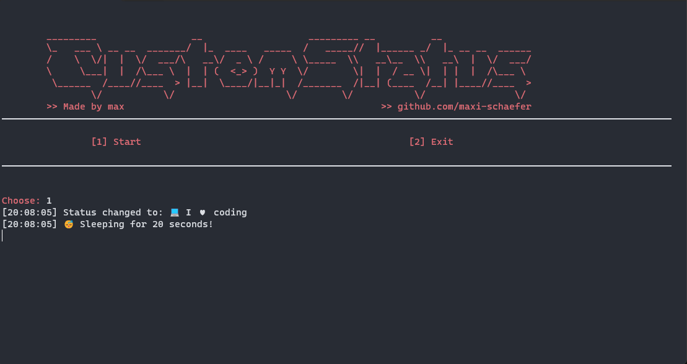

# animated-discord-status
Change your discord status, with delay

---



## ❗️ | Installation

!! You need python installed to use this application !!

1. Install requirements
```
python3 -m pip install -r requirements.txt
```

2. Start the application
```
./start.bat
```

## 📜 | Config
```json
{
    "Token": "YOUR TOKEN HERE",
    "Status1": "github.com/gokiimax",
    "Emoji1": "🖥",

    "Status2": "twitter.com/gokimax_x",
    "Emoji2": "💰",

    "Status3": "instagram.com/maxii.x6",
    "Emoji3": "🎭",
    "TimeBetweenChange": 10
}
```
